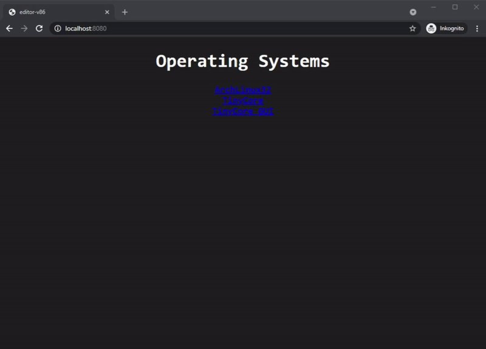

# editor-v86

[Demo](https://editor-v86.glitch.me/)  
  
  
  
## images

### ArchLinux32

https://archlinux32.org/  
https://github.com/copy/v86/blob/master/docs/archlinux.md  
  
- `cd build/bootable/archlinux32`
- `README`
- execute packer `packer build packer.json`
- TODO: `VirtIO 9p` filesystem  

### TinyCore

http://tinycorelinux.net/  
  
- `cd build/bootable/tinycore`
- `README`

### AlpineLinux

- `cd build/bootable/alpinelinux`
- `README`

## examples

Some examples for v86 emulation:  
https://github.com/copy/v86/tree/master/examples  

## start NodeJs

```
npm install
npm start
```