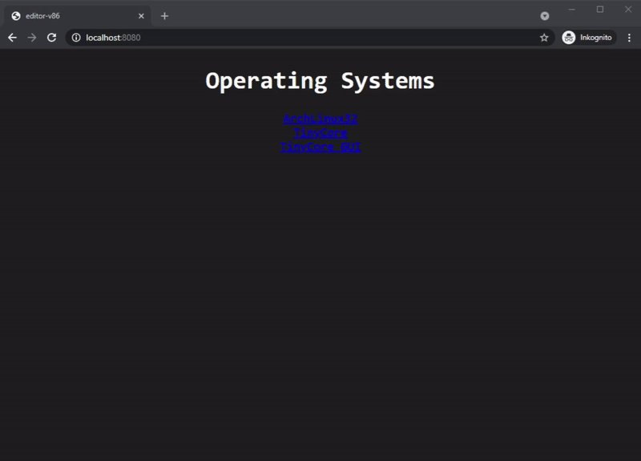

# editor-v86

This is an online **editor** that uses a **client-side x86-emulator (v86)**.  
  
[DEMO](https://editor-v86.glitch.me)  
  
  
  
I am using some well-known frameworks such as [v86](https://github.com/copy/v86) or [monaco-editor](https://microsoft.github.io/monaco-editor/) in this project.  
Because of its usability and good documentation, the [v86 emulator](https://github.com/copy/v86) is suitable for our purposes.  
You can adapt any compiler or programming language as you wish.  
  
## bootables

Build your own bootable linux distibution.  
I recommend using [qemu](https://www.qemu.org/download) and [packer](https://www.packer.io/downloads).  
  
`cd build/bootables/...`  
  
```bash
qemu-img create -f raw ...
qemu-system-... -hda ... -cdrom ... --boot d 
```

```bash
packer build ....json
```
  
*!!!* Make sure you use the `raw` disk image format.  
  
### recommended distributions

- [tinycore](http://tinycorelinux.net/)  
- [alpinelinux](https://www.alpinelinux.org/)  
- [archlinux32](https://archlinux32.org/)  
- [buildroot](https://buildroot.org/) _(script-collection to build ure own minimalistic distibution)_  
  
*!!!* Make sure you have activated the `serial terminal`.  
  
Copy the image to `public/bootables` and create an entry in `public/emulator.json`. 
  
## installation

Install [node.js](https://nodejs.org) and download all [dependencies](package.json).  

```bash
npm install
npm start
```

### use the electron client

Start the web service and follow the instructions below.
  
```bash
cd client

npm install
npm start
```
